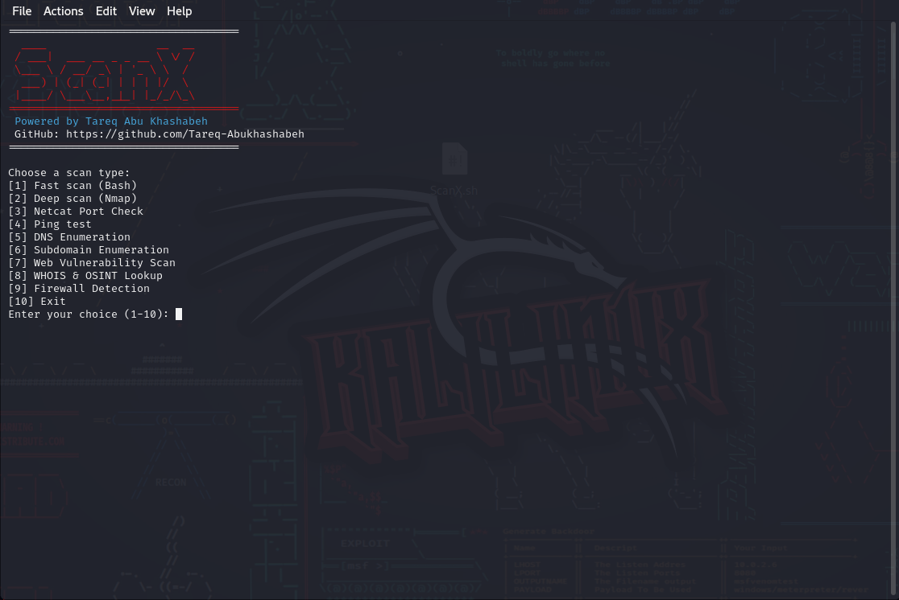

# 🚀 ScanX - Advanced Network Security Scanner
   

  

**Network Security Scanner** is an advanced **Bash-based** security scanning tool that allows users to scan networks, detect vulnerabilities, and gather intelligence on web targets.

🔹 **Features**:
- 🛡️ **Fast & Deep Nmap Scanning**
- 🔍 **Port Scanning with Netcat**
- 🌐 **DNS & Subdomain Enumeration**
- 📡 **Web Vulnerability Scanning (Nikto & WhatWeb)**
- 🔥 **Firewall Detection**
- 🕵️ **OSINT Recon (WHOIS, theHarvester)**

📌 **This tool is for educational and ethical penetration testing purposes only!**  
📌 **Use responsibly!** 🛑

---

## 🚀 Installation

### **1️⃣ Clone the repository**

git clone https://github.com/Tareq-Abukhashabeh/scanX.git

cd ScanX

### **2️⃣ Give execution permission**
chmod +x scanX.sh

### **3️⃣ Run the script**
sudo ./scanX.sh (# Note Root privileges are required for advanced scanning)

🔹 Usage
🔍 Run a Quick Nmap Scan
   sudo ./scanner.sh
📌 Follow the menu to select your desired scan!

### **📸 Screenshots For Menu**

### **⚡ Requirements**
🔹 Operating System: Linux (Ubuntu, Kali, Debian)
🔹 Dependencies:

nmap
nc (Netcat)
hping3
whois
theHarvester
dnsenum
nikto
whatweb
sublist3r
The script will automatically check and install missing tools if you approve.

### **⚠️ Disclaimer**
This tool is intended for ethical hacking, penetration testing, and cybersecurity learning.
The developer is not responsible for any misuse or illegal activities.
Please ensure you have permission before scanning any system.

### **📜 License**
This project is licensed under the MIT License. See the LICENSE file for details.

### **📅 Changelog**
See CHANGELOG.md for version history.

### **🌟 Support & Feedback**
📌 Issues? Suggestions? Open an issue or pull request on GitHub!
📌 Don't forget to ⭐ Star the Repo! 😊

### **📢 Credits**
🔹 Author: Tareq Abu Khashabeh(DRX0)
🔹 GitHub: Tareq-Abukhashabeh
🔹 Follow for updates! 🚀
